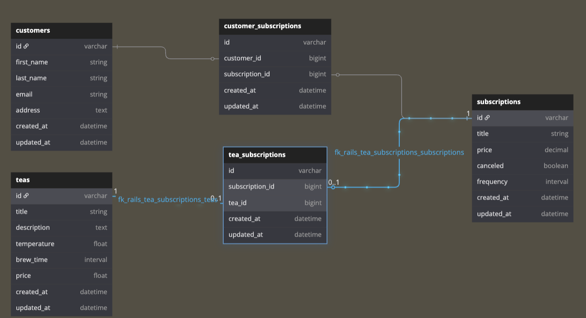
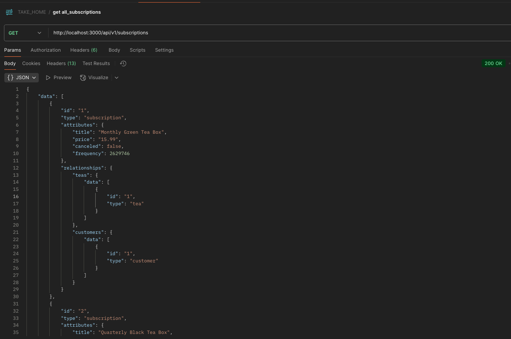
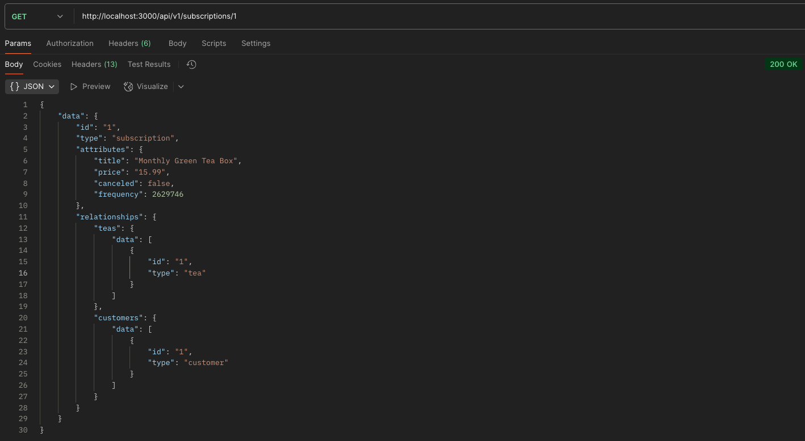
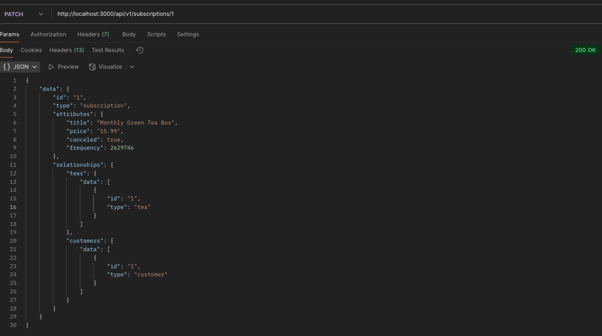

# Tea Subscription Service

## Overview
SubsTeaTution is a full-stack application that allows customers to cancel or reactivate thier subscription to a tea. 

It includes a Rails API for managing subscriptions, teas, and customers, as well as a React front-end that interacts with the API to manage and display subscription data.

## Functionality
What can I do?
I can:
- get all tea subscriptions
- get information about a specific subscription, including the teas involved and the customers.ids who are subscribed (including those who have been canceled)
- cancel a specific subscription
- filter subscriptions based on price,customers,and cancellation status


## Technologies Used
- **Backend**: Ruby on Rails (API-only)
- **Frontend**: React.js
- **Testing**: RSpec for backend testing, Jest for frontend testing
- **Database**: PostgreSQL (or another relational database)
- **Authentication**: Not required, but can be added if needed
- **API**: Rails API to handle tea subscriptions, customers, and tea details


## DB


### Relationships
- A **Customer** can have many **Subscriptions** through **CustomerSubscriptions**.
- A **Subscription** can have many **Teas** through **TeaSubscriptions**.
- A **Tea** can be associated with many **Subscriptions** through **TeaSubscriptions**.


## Endpoints

### 1. `GET /api/v1/subscriptions/`
- **Description**: Fetches all active tea subscriptions.
- **Response**: A JSON array of all subscriptions with details on the associated teas and customers.




### 2. `GET /api/v1/subscriptions/:id`
- **Description**: Fetches a specific subscription by ID.
- **Response**: A JSON object with details on the subscription, including teas involved and the customers subscribed.



### 3. `DELETE /api/v1/subscriptions/:id`
- **Description**: Cancels the specified subscription.
- **Response**: A success message and the updated subscription status (canceled).



## Models

### Tea
- `title`: Name of the tea
- `description`: A brief description of the tea
- `temperature`: Ideal brewing temperature in Celsius
- `brew_time`: Ideal brewing time in minutes

### Customer
- `first_name`: Customer's first name
- `last_name`: Customer's last name
- `email`: Customer's email address
- `address`: Customer's shipping address

### Subscription
- `title`: Name of the subscription (e.g., "Monthly Green Tea Box")
- `price`: Price of the subscription
- `status`: The current status of the subscription (active or canceled)
- `frequency`: Frequency of the subscription (e.g., monthly, quarterly, yearly)


## Installation

### Clone the Repo
```bash
git clone https://github.com/yourusername/tea-subscription-service.git
cd tea-subscription-service